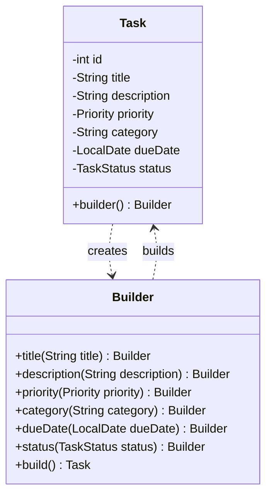
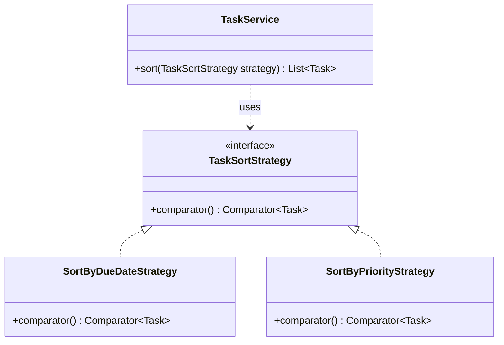

# Design Patterns

## Overview

This project uses design patterns to keep the Personal Task Tracker code organized, readable, and easier to extend. The patterns were chosen because they solve real problems in the application instead of being added only for documentation.

The two main patterns used are:

1. **Builder Pattern** — Creational
2. **Strategy Pattern** — Behavioral

---

## 1. Builder Pattern

### Category

Creational Pattern

### Location in Code

```text
src/main/java/edu/asu/sdt/tasktracker/model/Task.java
```

### Purpose

The `Task` class has several fields:

* ID
* title
* description
* priority
* category
* due date
* status

Using a long constructor with many parameters would make task creation harder to read and easier to use incorrectly. The Builder pattern allows `Task` objects to be created step by step with clear method names.

### Example Usage

```text
Task task = Task.builder()
        .title("Study")
        .description("Read chapter notes")
        .priority(Priority.HIGH)
        .category("School")
        .dueDate(LocalDate.of(2026, 6, 1))
        .build();
```

### Why This Pattern Was Chosen

The Builder pattern was chosen because task creation requires several fields. It makes object creation clearer than using a long constructor and makes the code easier to understand in the CLI, services, and tests.

### Benefit to the Application

* Avoids long constructors
* Makes task creation readable
* Makes tests easier to write
* Supports optional fields such as status
* Keeps object creation clean and understandable

### UML Class Diagram



---

## 2. Strategy Pattern

### Category

Behavioral Pattern

### Location in Code

```text
src/main/java/edu/asu/sdt/tasktracker/patterns/strategy/TaskSortStrategy.java
src/main/java/edu/asu/sdt/tasktracker/patterns/strategy/SortByDueDateStrategy.java
src/main/java/edu/asu/sdt/tasktracker/patterns/strategy/SortByPriorityStrategy.java
src/main/java/edu/asu/sdt/tasktracker/service/TaskService.java
```

### Purpose

The application must support sorting tasks by more than one field. Instead of placing all sorting logic directly inside the CLI or hard-coding every sorting option inside `TaskService`, sorting behavior is separated into strategy classes.

Each sorting strategy provides a different sorting rule.

### Strategy Interface

```text
public interface TaskSortStrategy {
    Comparator<Task> comparator();
}
```

### Concrete Strategies

```text
SortByDueDateStrategy
SortByPriorityStrategy
```

### Example Usage

```text
taskService.sort(new SortByDueDateStrategy());
taskService.sort(new SortByPriorityStrategy());
```

### Why This Pattern Was Chosen

The Strategy pattern was chosen because sorting behavior changes based on the user’s command. The CLI can select the correct sorting strategy, while `TaskService` only needs to apply the strategy it receives.

This keeps the sorting logic flexible and makes it easier to add more sorting options later.

### Benefit to the Application

* Keeps sorting logic separate from CLI code
* Makes it easy to add future sorting options
* Avoids a large sorting conditional inside `TaskService`
* Demonstrates a real behavioral design pattern
* Supports the project requirement for sorting by multiple fields

### UML Class Diagram



---

## Conclusion

The Builder and Strategy patterns are both useful in this project.

The Builder pattern improves task creation by making object construction readable and flexible. The Strategy pattern improves sorting by separating sorting rules into independent classes.

Together, these patterns make the project easier to maintain, test, and extend while keeping the implementation appropriate for a third-year undergraduate software engineering project.
